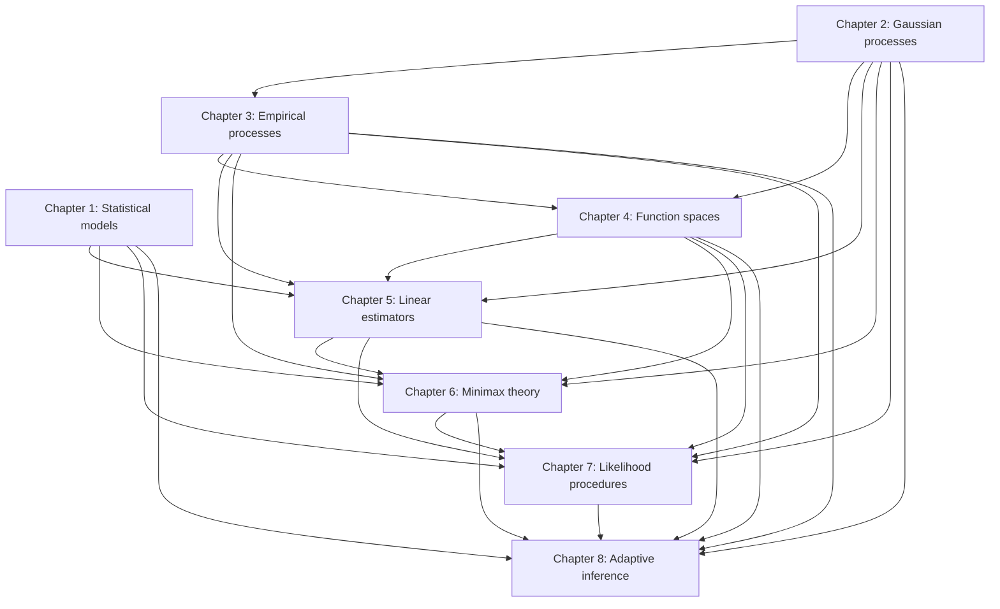

# Book-Level Dependency Graph

This graph is architectural. Declaration-level dependencies remain authoritative in each chapter specification.

## Formalisation strata

1. **Measure and experiment interfaces:** dominated models, product laws, Gaussian white noise, sequence experiments, likelihoods and expectations.
2. **Process infrastructure:** Gaussian and empirical processes, entropy, concentration, weak convergence and measurable suprema.
3. **Function-space infrastructure:** Fourier analysis, wavelets, Besov/Sobolev spaces, projections and approximation.
4. **Statistical constructions:** estimators, tests, minimax risks and confidence procedures.
5. **Adaptive and Bayesian results:** posterior contraction, Bernstein–von Mises results, model selection and adaptive confidence sets.

Edges must point from prerequisite to dependent. Cross-chapter references should use stable book labels until Lean declaration names are fixed. No dependency may be introduced merely to match the source proof when a substantially smaller mathlib dependency suffices.
